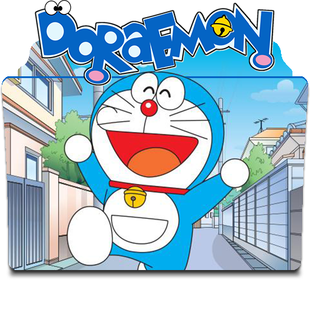

# Doraemon_Game
Final Project
<!DOCTYPE html>
<html>

 

    

      

        

  <header class="post-header about">
    
    <h1 class="post-title"><b>Dora</b><b>E</b>mon <b>G</b>ame</h1>
    <h2 class="post-description clearfix">Wafae Hamdaoui • Euromed University • 2022 </h2>
  </header>

  <article class="post-content <b>C</b>++ <b>G</b>UI <b>P</b>rogramming with <b>Q</b>T. clearfix">
    
<strong>QT</strong> is a compressive <strong>C++</strong> framework for developing cross-platform GUI
applications. The library uses the <em>Write Once, Compile Everywhere</em> paradigm. It
allows programmers to use a single source tree for applications that could run
on Window, Mac Os and Linux which makes perfect for embedded systems like
Rasberry Pi.

The purpose of this course is to teach students to write GUI programs using Qt5.
We will start by reviewing advanced OOP mechanisms (like polymorphism and
inheritance) of modern C++ using the 14
standard. After that, the student will start with a simple “Hello Qt” dialog and
quickly dive into more advanced topic like slots and signals. The final project
consist of creating a simple spreadsheet application with a set of useful
capabilities.

Upon completion of this course, you should be able to

<ul>
  <li>Confidently use C++ OOP paradigms</li>
  <li>Create its own dialogs and applications.</li>
  <li>Extend the concept of signals and slots to more event driven programming
challenges.</li>
</ul>

<ul>
  <li><strong>Time:</strong> Monday/Tuesday/Wednesday/Thursday 08:30-12:00 am</li>
  <li><strong>Location:</strong> Center B4.</li>
  <li><strong>Discussion and QA:</strong> <a href="" target="\_blank">Piazza</a>
<!-- - **HW submission:** [Gradescope](https://www.gradescope.com/courses/56699){:target="\_blank"} and [Autolab](https://autolab.andrew.cmu.edu/courses/10703-f19){:target="\_blank"} -->
<!-- - **Online lectures:** The lectures will be live-streamed through [Panopto](https://scs.hosted.panopto.com/Panopto/Pages/Sessions/List.aspx?folderID=31ef94d5-b20b-416f-9073-aaaf0125efa8){:target="\_blank"} and recorded as well. --></li>
  <li><strong>Contact:</strong> For external enquiries, personal matters or in emergencies, you can email me at  <em>a.belcaid@ueuromed.org</em>.</li>
</ul>

  </article>

  <!-- Staff  -->
  

  
  

    
    <ul class="instructor-info">
      <li>Instructor <a href="https://anassbelcaid.github.io/" target="_blank">Anass  Belcaid</a></li>
      <li>Email: <a href="mailto:%61.%62%65%6C%63%61%69%64@%75%65%75%72%6F%6D%65%64.%6F%72%67" target="_blank">a.belcaid@ueuromed.org</a></li>
      <li>Office hours: Monday, Wednesday 04:00-06:00pm</li>
    </ul>
  

  

  

  <!-- Announcements  -->
  

  <h2>Announcements</h2>
  
    <table>
    
    
      <tr>
        <td class="date">Aug 19, 2019</td>
        <td class="announcement">
          
            <a class="announcements-title" href="/announcements/2019-08-26-description/">Formal Course Description</a>
          
        </td>
      </tr>
    
    </table>
  

      

    

    <footer class="site-footer">

  

    <h2 class="footer-heading">C++ GUI Programming with QT</h2>

    

      

        <ul class="contact-list">
          <li class="p-name">A.belcaid</li><li><a class="u-email" href="mailto:anass.belcaid@gmail.com">anass.belcaid@gmail.com</a></li></ul>
      

      
<ul class="social-media-list"><li><a href="https://github.com/anassBelcaid" target="_blank"><i class="fab fa-github"></i> anassBelcaid</a></li></ul>

      

        
&copy; Copyright 2021 Euromed University.  
        Powered by <a href="http://jekyllrb.com/" target="_blank">Jekyll</a> with <a href="https://github.com/alshedivat/al-folio">al-folio</a> theme.

      

    

  

</footer>

    <!-- Load jQuery -->

<!-- Load Common JS -->

<!-- Load KaTeX -->
<link rel="stylesheet" href="//cdnjs.cloudflare.com/ajax/libs/KaTeX/0.10.1/katex.min.css">

<!-- Load Anchor JS -->

<!-- Adjust LaTeX JS -->

<!-- Include custom icon fonts -->
<link rel="stylesheet" href="/assets/css/fontawesome-all.min.css">
<link rel="stylesheet" href="/assets/css/academicons.min.css">

<!-- Google Analytics -->

  </body>

</html>
